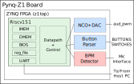

# Checkpoint 1/2: 3-Stage Pipelined RISC-V CPU
The first and second checkpoints in this project is designed to guide the development of a three-stage pipelined RISC-V CPU that will be used as a base system in subsequent checkpoints.

## Project Overview
<p align=center>
  
</p>

- The green (RISC-V core) block on the diagram is the focus of Checkpoints 1 and 2.
- Checkpoint 3 will add audio and IO components in blue.
- Finally, Checkpoint 4 will implement the BPM (beats per minute) detector unit in red.

## Setting up Your Repository
The project skeleton files are available on Github.
The suggested way for initializing your repository (`fa21_fpga_teamXX`) with the skeleton files is as follows:

```bash
git clone git@github.com:EECS150/fa21_fpga_teamXX.git
git remote add skeleton git@github.com:EECS150/project_skeleton_fa21.git
git pull skeleton master
git push origin master
```

To pull project updates from the skeleton repo, run `git pull skeleton master`.
To push updates to your team repo, run `git add`, `git commit`, and `git push origin master`.

**You should check frequently for updates to the skeleton files.**
Whenever you resume your work on the project, it is highly suggested that you do `git pull` from the skeleton repo to get the latest update.
Update announcements will be posted to Piazza.

### Getting a Team Repo
To get a team repo, add your team members' info to [this Google spreadsheet](https://docs.google.com/spreadsheets/d/1WKeMn8X4Kfe9oiq2fJlTf6Gyqsy0dxPu9tbZad-N5vA/edit?usp=sharing).

## Integrate Designs from Labs
You should copy some modules you designed from the labs into `hardware/src/io_circuits`.

**Copy these files**:
```text
debouncer.v
synchronizer.v
edge_detector.v
fifo.v
uart_transmitter.v
```

## Project Skeleton Overview
- `hardware`
  - `src`
    - `z1top.v`: Top level module. The RISC-V CPU is instantiated here.
    - `riscv_core/cpu.v`: All of your CPU datapath and control should be contained in this file.
    - `riscv_core/opcode.vh`: Constant definitions for various RISC-V opcodes and funct codes. Use `` `include "opcode.vh" `` to use the defines in this file.
    - `io_circuits`: Your IO circuits from the labs.
  - `sim`
    - `cpu_tb.v`: Starting point for testing your CPU. The testbench checks if your CPU can execute all the RV32I instructions (including CSR ones) correctly, and can handle some simple hazards. You should make sure that your CPU implementation passes this testbench before moving on.
    - `asm_tb.v`: This testbench works with the software in `software/assembly_tests`.
    - `isa_tb.v`: This testbench works with the RISC-V ISA test suite in `software/riscv-isa-tests`. The testbench only runs one test at a time. To run multiple tests, use the Makefile target we provide (see [RISC-V ISA Tests](#riscv-isa-tests). There are a total of 38 ISA tests in the test suite.
    - `c_tests_tb.v`: This testbench verifies the correct execution of the software in `software/c_tests`. There are 6 C tests provided.
    - `echo_tb.v`: This testbench works with the software in `software/echo`. The CPU reads a character sent from the serial rx line and echoes it back to the serial tx line.
    - `uart_parse_tb.v`: This testbench verifies a few tricky functions from the BIOS in isolation using the software in `software/uart_parse`.
    - `bios_tb.v`: This testbench simulates the execution of the BIOS program. It checks if your CPU can execute the instructions stored in the BIOS memory. The testbench also emulates user input sent over the serial rx line, and checks the BIOS message output obtained from the serial tx line.
- `software`
  - `bios`: The BIOS program, which allows us to interact with our CPU via the UART. You need to compile it before creating a bitstream or running a simulation.
  - `echo`: The echo program, which emulates the echo test of Lab 5 in software.
  - `asm`: Use this as a template to write assembly tests for your processor designed to run in simulation.
  - `c_tests`: Use these as examples to write C programs for testing.
  - `riscv-isa-tests`: A comprehensive test suite for your CPU. Available after running `git submodule` (see [RISC-V ISA Tests](#riscv-isa-tests)).
  - `mmult`: This program is to be run on the FPGA for Checkpoint 1. It generates 2 matrices and multiplies them. Then it returns a checksum to verify the correct result.

To compile `software` go into a program directory and run `make`.
To build a bitstream run `make impl` in `hardware`.

## RISC-V 151 ISA
The table below contains all of the instructions your processor is responsible for supporting.

<p align=center>
  <a href="./figs/isa.pdf"></a>
</p>
<p align=center>
  <em>RISC-V RV32I + CSR ISA to implement in your processor</em>
</p>

It contains most of the instructions specified in the RV32I Base Instruction set, and allows us to maintain a relatively simple design while still being able to use a C compiler and write interesting programs to run on the processor.
For the specific details of each instruction, refer to sections 2.2 through 2.6 in the [RISC-V ISA Manual](https://riscv.org/wp-content/uploads/2017/05/riscv-spec-v2.2.pdf).

### CSR Instructions
You will have to implement 2 CSR instructions to support running the standard RISC-V ISA test suite.
A CSR (or control status register) is some state that is stored independent of the register file and the memory.
While there are `2^12` possible CSR addresses, you will only use one of them `tohost = 0x51E`).

The `tohost` CSR is monitored by the RISC-V ISA testbench (`isa_tb.v`), and simulation ends when a non-zero value is written to this register.
A CSR value of 1 indicates success, and a value greater than 1 indicates which test failed.

There are 2 CSR related instructions that you will need to implement:
  - `csrw tohost, x2` (short for `csrrw x0, csr, rs1` where `csr = 0x51E`)
  - `csrwi tohost, 1` (short for `csrrwi x0, csr, uimm` where `csr = 0x51E`)

`csrw` will write the value from `rs1` into the addressed CSR.
`csrwi` will write the immediate (stored in the `rs1` field of the instruction) into the addressed CSR.
Note that you do not need to write to `rd` (writing to x0 does nothing), since the CSR instructions are only used in simulation.

## Pipelining
Your CPU must implement this instruction set using a 3-stage pipeline.
The division of the datapath into three stages is left unspecified as it is an important design decision with significant performance implications.
We recommend that you begin the design process by considering which elements of the datapath are synchronous and in what order they need to be placed.

After determining the design blocks that require a clock edge, consider where to place asynchronous blocks to minimize the critical path.
The RAMs we are using for the data, instruction, and BIOS memories are both **synchronous** read and **synchronous** write.

## Hazards
As you have learned in lecture, pipelines create hazards.
Your design will have to resolve both control and data hazards.
You must resolve data hazards by implementing forwarding whenever possible.
This means that you must forward data from your data memory instead of stalling your pipeline or injecting NOPs.
All data hazards can be resolved by forwarding in a three-stage pipeline.

You'll have to deal with the following types of hazards:

- **Read-after-write data hazards** Consider carefully how to handle instructions that depend on a preceding load instruction, as well as those that depend on a previous arithmetic instruction.
- **Control hazards** What do you do when you encounter a branch instruction, a jal (jump and link), or jalr (jump from register and link)? You will have to choose whether to predict branches as taken or not taken by default and kill instructions that weren't supposed to execute if needed. You can begin by resolving branches by stalling the pipeline, and when your processor is functional, move to naive branch prediction.

## Register File
We have provided a register file skeleton for you in `riscv_core/reg_file.v`.
The register file has two asynchronous-read ports and one synchronous-write port (positive edge).
In addition, you should ensure that register 0 is not writable in your own logic, i.e. reading from register 0 always returns 0.

## RAMs
The RAMs used for the project are provided for you in `hardware/src/memories`.
The behavioral Verilog for these memories is written so that Vivado will infer Block RAMs to implement them.
Read and write to memory are **synchronous**.

### Initialization
For synthesis, the BIOS memory is initialized with the contents of the BIOS program (see `bios_mem.v`), and the other memories are zeroed out.
For simulation, the provided testbenches initialize the BIOS memory with a program specified by the testbench (see the `$readmemh` call in `sim/asm_tb.v`).

### Endianness + Addressing
The instruction and data RAMs have 16384 32-bit rows, as such, they accept 14 bit addresses.
The RAMs are **word-addressed**; this means that every unique 14 bit address refers to one 32-bit row (word) of memory.

However, the memory addressing scheme of RISC-V is **byte-addressed**.
This means that every unique 32 bit address the processor computes (in the ALU) points to one 8-bit byte of memory.

We consider the bottom 16 bits of the computed address (from the ALU) when accessing the RAMs.
The top 14 bits are the word address (for indexing into one row of the block RAM), and the bottom two are the byte offset (for indexing to a particular byte in a 32 bit row).

<p align=center>
  
</p>
<p align=center>
  <em>Figure 1: Block RAM organization. The labels for row address should read 14'h0 and 14'h1</em>
</p>

Figure 1 illustrates the 14-bit word addresses and the two bit byte offsets.
Observe that the RAM organization is **little-endian**, i.e. the most significant byte is at the most significant memory address (offset '11').

### Reading from RAMs
Since the RAMs have 32-bit rows, you can only read data out of the RAM 32-bits at a time.
This is an issue when executing an `lh` or `lb` instruction, as there is no way to indicate which 8 or 16 of the 32 bits you want to read out.

Therefore, you will have to shift and mask the output of the RAM to select the appropriate portion of the 32-bits you read out.
For example, if you want to execute a `lbu` on a byte address ending in `2'b10`, you will only want bits `[23:16]` of the 32 bits that you read out of the RAM (thus storing `{24'b0, output[23:16]}` to a register).

### Writing to RAMs
To take care of `sb` and `sh`, note that the `we` (write enable) input to the instruction and data memories is 4 bits wide.
These 4 bits are a byte mask telling the RAM which of the 4 bytes to actually write to.
If `we ={4'b1111}`, then all 32 bits passed into the RAM would be written to the address given.

Here's an example of storing a single byte:

- Write the byte `0xa4` to address `0x10000002` (byte offset = 2)
- Set `we = {4'b0100}`
- Set `din = {32'hxx_a4_xx_xx}` (`x` means don't care)


## Memory Architecture
The standard RISC pipeline is usually depicted with separate instruction and data memories.
Although this is an intuitive representation, it does not let us modify the instruction memory to run new programs.
Your CPU, by the end of this checkpoint, will be able to receive compiled RISC-V binaries though the UART, store them into instruction memory, then jump to the downloaded program.
To facilitate this, we will adopt a modified memory architecture shown in the figure below.

<p align=center>
  
</p>
<p align=center>
  <em>Figure 2: The RISC-V core memory architecture. There is only 1 IMEM and DMEM instance in the CPU but their ports are shown separately in this figure for clarity. The left half of the figure shows the instruction fetch logic and the right half shows the memory load/store logic.</em>
</p>

### Summary of Memory Access Patterns
The memory architecture will consist of three RAMs (instruction, data, and BIOS).
The RAMs are memory resources (block RAMs) contained within the FPGA chip, and no external (off-chip, DRAM) memory will be used for this project.

The processor will begin execution from the BIOS memory, which will be initialized with the BIOS program (in `software/bios`).
The BIOS program should be able to read from the BIOS memory (to fetch static data and instructions), and read and write the instruction and data memories.
This allows the BIOS program to receive user programs over the UART from the host PC and load them into instruction memory.

You can then instruct the BIOS program to jump to an instruction memory address, which begins execution of the program that you loaded.
At any time, you can press the reset button on the board to return your processor to the BIOS program.

### Unaligned Memory Accesses
In the official RISC-V specification, unaligned loads and stores are supported.
However, in your project, you can ignore instructions that request an unaligned access.
Assume that the compiler will never generate unaligned accesses.

### Address Space Partitioning
Your CPU will need to be able to access multiple sources for data as well as control the destination of store instructions.
In order to do this, we will partition the 32-bit address space into four regions: data memory read and writes, instruction memory writes, BIOS memory reads, and memory-mapped I/O.
This will be encoded in the top nibble (4 bits) of the memory address generated in load and store operations, as shown in the table below.
In other words, the target memory/device of a load or store instruction is dependent on the address.
The reset signal should reset the PC to the value defined by the parameter `RESET_PC` which is by default the base of BIOS memory (`0x40000000`).

| Address[31:28] | Address Type | Device             | Access     | Notes                  |
|----------------|--------------|--------------------|------------|------------------------|
| 4'b00x1        | Data         | Data Memory        | Read/Write |                        |
| 4'b0001        | PC           | Instruction Memory | Read-Only  |                        |
| 4'b001x        | Data         | Instruction Memory | Write-Only | Only if PC[30] == 1'b1 |
| 4'b0100        | PC           | BIOS Memory        | Read-only  |                        |
| 4'b0100        | Data         | BIOS Memory        | Read-only  |                        |
| 4'b1000        | Data         | I/O                | Read/Write |                        |

Each partition specified in this table should be enabled based on its associated bit in the address encoding.
This allows operations to be applied to multiple devices simultaneously, which will be used to maintain memory consistency between the data and instruction memory.

For example, a store to an address beginning with `0x3` will write to both the instruction memory and data memory, while storing to addresses beginning with `0x2` or `0x1` will write to only the instruction or data memory, respectively.
For details about the BIOS and how to run programs on your CPU, see [BIOS and Programming Your CPU](#bios-and-programming-your-cpu).

Please note that a given address could refer to a different memory depending on which address type it is.
For example the address `0x10000000` refers to the data memory when it is a data address while a program counter value of `0x10000000` refers to the instruction memory.

The note in the table above (referencing PC[30]), specifies that you can only write to instruction memory if you are currently executing in BIOS memory.
This prevents programs from being self-modifying, which would drastically complicate your processor.

### Memory Mapped IO
At this stage in the project the only way to interact with your CPU is through the UART.
The UART from Lab 5 accomplishes the low-level task of sending and receiving bits from the serial lines, but you will need a way for your CPU to send and receive bytes to and from the UART.
To accomplish this, we will use memory-mapped I/O, a technique in which registers of I/O devices are assigned memory addresses.
This enables load and store instructions to access the I/O devices as if they were memory.

To determine CPI (cycles per instruction) for a given program, the I/O memory map is also used to include instruction and cycle counters.

The table below shows the memory map for this stage of the project.

| Address      | Function              | Access | Data Encoding                                          |
|--------------|-----------------------|--------|--------------------------------------------------------|
| 32'h80000000 | UART control          | Read   | {30'b0, uart_rx_data_out_valid, uart_tx_data_in_ready} |
| 32'h80000004 | UART receiver data    | Read   | {24'b0, uart_rx_data_out}                              |
| 32'h80000008 | UART transmitter data | Write  | {24'b0, uart_tx_data_in}                               |
| 32'h80000010 | Cycle counter         | Read   | Clock cycles elapsed                                   |
| 32'h80000014 | Instruction counter   | Read   | Number of instructions executed                        |
| 32'h80000018 | Reset counters to 0   | Write  | N/A                                                    |

You will need to determine how to translate the memory map into the proper ready-valid handshake signals for the UART.
Your UART should respond to `sw, sh, and sb` for the transmitter data address, and should also respond to `lw, lh, lb, lhu, and lbu` for the receiver data and control addresses.

You should treat I/O such as the UART just as you would treat the data memory.
This means that you should assert the equivalent write enable (i.e. valid) and data signals at the end of the execute stage, and read in data during the memory stage.
The CPU itself should not check the `uart_rx_data_out_valid` and `uart_tx_data_in_ready` signals; this check is handled in software.
The CPU needs to drive `uart_rx_data_out_ready` and `uart_tx_data_in_valid` correctly.

The cycle counter should be incremented every cycle, and the instruction counter should be incremented for every instruction that is committed (you should not count bubbles injected into the pipeline or instructions run during a branch mispredict).
From these counts, the CPI of the processor can be determined for a given benchmark program.

## Testing
The design specified for this project is a complex system and debugging can be very difficult without tests that increase visibility of certain areas of the design.
In assigning partial credit at the end for incomplete projects, we will look at testing as an indicator of progress.
A reasonable order in which to complete your testing is as follows:

1. Test that your modules work in isolation via Verilog testbenches that you write yourself
1. Test that your CPU pipeline works with `sim/cpu_tb.v`
1. Test the entire CPU one instruction at a time with hand-written assembly using `sim/asm_tb.v`
1. Run the `riscv-tests` ISA test suite (`make isa-tests`)
1. Some extra tests with other software C program, such as the `c_tests` and `uart_parse`. They could help reveal more bugs -- see `c_tests_tb.v` and `uart_parse_tb.v`
1. Test the CPU's memory mapped I/O --- see `echo_tb.v`
1. Test the CPU's memory mapped I/O with BIOS software program --- see `bios_tb.v`

### Unit Tests
You should write unit tests for the isolated components of your CPU such as the register file, decoder, and ALU in `hardware/sim`.
The tests should contain assertions and check correct behavior under several common and extreme conditions.

Run them just like you did in the labs. `make sim/tb.fst` (iverilog) or `make sim/tb.vpd` (VCS).
View the waveforms with `gtkwave sim/tb.fst &` or `dve -vpd sim/tb.vpd &`.

### CPU Test
Once you are confident that the individual components of your processor are working in isolation, you will want to test the entire processor as a whole.
The provided `sim/cpu_tb.v` tests all the RV32I instructions.
Run it as usual.

To pass this testbench, you should have a working CPU implementation that can decode and execute all the instructions in the spec, including the CSR instructions.
Several basic hazard cases are also tested.

The testbench does not work with any software code as in the following sections, but rather it manually initializes the instructions and data in the memory blocks as well as the register file content for each test.
The testbench does not cover reading from BIOS memory nor memory mapped IO. You will need to complete these components before moving on with other testbenches.

### Assembly Tests
Once the `cpu_tb` passes, you should write more assembly tests by hand to aggresively test hazards, branches, and jumps.
You should write your assembly tests in `software/asm/start.s` with the corresponding testbench in `hardware/sim/asm_tb.v`.

Initially, and if you change `start.s` you need to **run `make`** in `software/asm` before running `make sim/asm_tb.vpd`.
To force simulation to run even if your RTL hasn't changed, you can use the -B flag, like `make -B sim/asm_tb.vpd`.
This applies to **all** software testbenches.

`start.s` contains assembly that's compiled and loaded into the BIOS RAM by the testbench.

```asm
_start:

# Test ADD
li x10, 100         # Load argument 1 (rs1)
li x11, 200         # Load argument 2 (rs2)
add x1, x10, x11    # Execute the instruction being tested
li x20, 1           # Set the flag register to stop execution and inspect the result register
                    # Now we check that x1 contains 300 in the testbench

Done: j Done
```

The `asm_tb` toggles the clock one cycle at time and waits for register `x20` to be written with a particular value (in the above example: 1).
Once `x20` contains 1, the testbench inspects the value in `x1` and checks it is 300, which indicates your processor correctly executed the add instruction.

If the testbench times out it means `x20` never became 1, so the processor got stuck somewhere or `x20` was written with another value.

You should add your own tests to verify that your processor can execute different instructions correctly.
Modify the file `start.s` to add your assembly code, modify `asm_tb.v` to add your checks, and then rerun the RTL simulation.

<a name="riscv-isa-tests"></a>
### RISC-V ISA Tests
You will need the CSR instructions to work before you can use this test suite, and you should have confidence in your hand-written assembly tests.

To run the ISA tests, first pull the latest skeleton changes:
``` shell
git pull skeleton master
git submodule update --init --recursive
```

The rv32i tests will be cloned into `software/riscv-isa-tests/riscv-tests/isa/rv32ui/`.

To compile the tests run:
```shell
cd software/riscv-isa-tests && make
```

To run the tests run:
```shell
cd hardware
make isa-tests  # to run all ISA tests
make sim/isa/lw.fst  # to run a specific test
grep -r -i "failed" sim/isa/*.log  # to check for failures
grep -r -i "passed" sim/isa/*.log  # to check for passing tests
grep -r -i "timeout" sim/isa/*.log  # to check for tests that timed out
```

The simulation log details which tests passed and failed and the number of clock cycles elapsed.
If you're failing a test, debug using the test assembly file in `software/riscv-isa-tests/riscv-tests/isa/rv32ui` or the generated assembly dump.

The assembly dump files are extremely helpful in debugging at this stage.
If you look into a particular dump file of a test (e.g., `add.dump`), it contains several subtests in series.
The CSR output from the simulation indicates which subtest is failing to help you narrow down where the problem is, and you can start debugging from there.

The `RESET_PC` parameter is used in `isa_tb` to start the test in the IMEM instead of the BIOS.
Make sure you have used it in `riscv_core/cpu.v`.

The `fence_i` test may fail, and that is **OK**.

### RISC-V Programs

#### Compiler Toolchain
Here's some background about the the toolchain that's used to compile RISC-V binaries.
The GCC RISC-V cross-compiler toolchain is avaialble on any of the c111 machines.

The most relevant programs in the toolchain are:
- `riscv64-unknown-elf-gcc`: GCC for RISC-V, compiles C code to RISC-V binaries.
- `riscv64-unknown-elf-as`: RISC-V assembler, compiles assembly code to RISC-V binaries.
- `riscv64-unknown-elf-objdump`: Dumps RISC-V binaries as readable assembly code.

Look at the `software/echo` folder for an example of a C program.

There are several files:

- `start.s`: This is an assembly file that contains the start of the program.
      It initialises the stack pointer (`sp`) then jumps to the `main` label.
      Edit this file to move the top of the stack.
      Typically your stack pointer is set to the top of the data memory address space, so that the stack has enough room to grow downwards.
- `echo.ld`: This linker script sets the base address of the program.
      For Checkpoint 1, this address should be in the format `0x1000xxxx` (indicating the base of IMEM/DMEM).
      The .text segment offset is typically set to the base of the instruction memory address space.
- `echo.elf`: Binary produced after running `make`.
- `echo.dump`: Assembly dump of the binary.

#### C Tests
Next, you will test your processor with some small RISC-V C programs.
We use the RISC-V software toolchain to compile a program to a hex file that is used to initialize the `imem` and `dmem`.

The C tests are in `software/c_tests`.
You should go into each folder, understand what the program is trying to do, and **run `make`** to generate a `.hex` file.
The available tests include: `strcmp`, `vecadd`, `fib`, `sum`, `replace`, `cachetest`.

To run the tests:
```shell
cd hardware
make c-tests  # run all C tests
make sim/c_tests/fib.fst  # run the fib C test
```

These tests could help reveal more hazard bugs in your implementation.
`strcmp` is particularly important since it is frequently used in the BIOS program.

The tests use CSR instruction to indicate if they are passed (e.g., write '1' to the CSR register if passed).
Following that practice, you can also **write your custom C programs** to further test your CPU.

As an additional tip for debugging, try changing the compiler optimization flag in the `Makefile` of each software test (e.g., `-O2` to `-O1` or `-O0`) and see if your processor still passes the test.
Different compiler settings generate different sequences of assembly instructions, and some might expose subtle hazard bugs yet to be covered by your implementation.

### Echo Program Test
You should have your UART modules integrated with the CPU before running this test.
The test verifies if your CPU is able to: check the UART status, read a character from UART Receiver, and write a character to UART Transmitter.

Take a look at the software code `software/echo/echo.c` to see what it does.
The testbench loads the hex file compiled from the software code, and load it to the BIOS memory in a similar manner to the `asm` test and `riscv-isa-tests`.

To compile echo:
```shell
cd software/echo && make
```

To run the test:
```shell
cd hardware
make sim/echo_tb.fst  # or .vpd
```

The testbench acts like a host and sends multiple characters via the serial line, then waits until it receives all the characters back.
In some sense, it is similar to the echo test in Lab 5, however, the UART modules are controlled by the software program (`software/echo/echo.c`) running on your RISC-V CPU.

Once you pass the echo test, also try `sim/uart_parse_tb.v`.
This test combines both UART operations and string comparison.
It covers the basic functionality of the BIOS program, but is shorter and easier to debug than the BIOS testbench.
Make sure to compile the `.hex` file in the `software` directory first.

## BIOS and Programming your CPU
We have provided a BIOS program in `software/bios` that allows you to interact with your CPU and download other programs over UART.
The BIOS program is an infinite loop that reads from the UART, checks if the input string matches a known control sequence, and then performs an associated action.
For detailed information on the BIOS, see **TODO: BIOS appendix**

### Compiling the BIOS
Verify that the stack pointer and .text segment offset are set properly in `start.s` and `bios.ld` in `software/bios` directory.
Run `make` to generate `bios.hex`, which is used to initialize the BIOS memory (see `hardware/src/memories/bios_mem.v`).

### BIOS Testbench
Before running the BIOS program on your FPGA, run the `sim/bios_tb.v` testbench.
It testbench emulates the interaction between the host and your CPU via the serial lines orchestrated by the BIOS program.

It tests four basic functions of the BIOS program: sending an invalid command, storing to an address (in `imem` or `dmem`), loading from an address (in `imem` or `dmem`), and jumping to an address (from `bios_mem` to `imem`).

Once you pass the BIOS testbench, you can implement and test your processor on the FPGA!

### FPGA Build Flow
The build flow is identical to the labs.
Run `make synth` in `hardware` to synthesize `z1top`, run `make impl` to run place and route and bitstream generation, and run `make program` to program the bitstream onto the FPGA.
All the make targets are documented in the [hardware README](../hardware/README.md).

Make sure you **check the synthesis log** in `build/synth/synth.log` for unexpected warnings before proceeding to place and route.
If you see these info/warning messages in the log; they are OK and expected:
```text
WARNING: [Synth 8-6841] Block RAM (mem_reg) originally specified as a Byte Wide Write Enable RAM ...

INFO: [Synth 8-7052] The timing for the instance cpu/dmem/mem_reg_0_0 might be sub-optimal ...
```

### Testing the BIOS on the FPGA
Use screen to access the serial port:
```shell
screen $SERIALTTY 115200
# or
# screen /dev/ttyUSB0 115200
```

Press the reset button to make the CPU PC go to the start of BIOS memory.

Close screen using `Ctrl-a Shift-k`, or other students won't be able to use the serial port!
If you can't access the serial port you can run `killscreen` to kill all screen sessions.

#### BIOS Commands
If all goes well, you should see a `151 >` prompt after pressing return. The following commands are available:

- `jal <address>`: Jump to address (hex).
- `sw, sb, sh <data> <address>`: Store data (hex) to address (hex).
- `lw, lbu, lhu <address>`: Prints the data at the address (hex).

(if you want to backspace, press `Ctrl + Backspace`)

As an example, running `sw cafef00d 10000000` should write to the data memory and running `lw 10000000` should print the output `10000000: cafef00d`.
Please also pay attention that writes to the instruction memory (`sw ffffffff 20000000`) do not write to the data memory, i.e. `lw 10000000` still should yield `cafef00d`.

##### Loading New Programs
In addition to the command interface, the BIOS allows you to load programs to the CPU.
**With screen closed**, run:
```shell
./scripts/hex_to_serial <hex_file> <address>
```

This script stores the `.hex` file at the specified hex address.
In order to write into both the data and instruction memories, **remember to set the top nibble of the address to 0x3**.
(i.e. `./scripts/hex_to_serial software/echo/echo.hex 30000000`, assuming `echo.ld` sets the base address to `0x10000000`).

You also need to ensure that the stack and base address are set properly.
For example, before making the `mmult` program you should set the set the base address to `0x10000000`.
Therefore, when loading the `mmult` program you should load it at the base address: `./scripts/hex_to_serial software/mmult/mmult.hex 30000000`.
Then, you can jump to the loaded `mmult` program in in your screen session by using `jal 10000000`.

## Target Clock Frequency
By default, the CPU clock frequency is set at 50MHz.
It should be easy to meet timing at 50 MHz.
Look at the timing report (`build/impl/post_route_timing_summary.rpt`) to see if timing is met.
If you failed, the timing reports specify the critical path you should optimize.

For this checkpoint, we will allow you to demonstrate the CPU working at 50 MHz, but for the final checkoff at the end of the semester, you will need to optimize for a higher clock speed (> 100MHz) for full credit.
Details on how to build your FPGA design with a different clock frequency will come later.

## Matrix Multiply
To check the correctness and performance of your processor we have provided a benchmark in `software/mmult` which performs matrix multiplication.
You should be able to load it into your processor in the same way as loading the `echo` program.

This program computes `S=AB`, where `A` and `B` are `64 X 64` matrices.
The program will print a checksum and the counters discussed in [Memory Mapped IO](#memory-mapped-io).
The correct checksum is `0001f800`.
If you do not get this, there is likely a problem in your CPU with one of the instructions that is used by the BIOS but not mmult.

The matrix multiply program requires that the stack pointer and the offset of the .text segment be set properly, otherwise the program will not execute properly.

The stack pointer (set in `start.s`) should start near the top of DMEM to avoid corrupting the program instructions and data.
It should be set to `0x1000fff0` and the stack grows downwards.

The .text segment offset (set in `mmult.ld`) needs to accommodate the full set of instructions and static data (three `64 X 64` matrices) in the mmult binary.
It should be set to the base of DMEM: `0x10000000`.

The program will also output the values of your instruction and cycle counters (in hex).
These can be used to calculate the CPI for this program.
Your target CPI should **not be greater than 1.2**.

If your CPI exceeds this value, you will need to modify your datapath and pipeline to reduce the number of bubbles inserted for resolving control hazards (since they are the only source of extra latency in our processor).
This might involve performing naive branch prediction or moving the jalr address calculation to an earlier stage.

## How to Survive This Checkpoint
Start early and work on your design incrementally.
Draw up a very detailed and organised block diagram and keep it up to date as you begin writing Verilog.
Unit test independent modules such as the control unit, ALU, and regfile.
Write thorough and complex assembly tests by hand, and don't solely rely on the RISC-V ISA test suite.
The final BIOS program is several 1000 lines of assembly and will be nearly impossible to debug by just looking at the waveform.

The most valuable asset for this checkpoint will not be your GSIs but will be your fellow peers who you can compare notes with and discuss design aspects with in detail.
However, do NOT under any circumstances share source code.

Once you're tired, go home and **sleep**. When you come back you will know how to solve your problem.

### How To Get Started
It might seem overwhelming to implement all the functionality that your processor must support. The best way to implement your processor is in small increments, checking the correctness of your processor at each step along the way. Here is a guide that should help you plan out Checkpoint 1 and 2:

- **Design.** You should start with a comprehensive and detailed design/schematic. Enumerate all the control signals that you will need. Be careful when designing the memory fetch stage since all the memories we use (BIOS, instruction, data, IO) are synchronous.
- **First steps.** Implementing some modules that are easy to write and test.
- **Control Unit + other small modules.** Implement the control unit, ALU, and any other small independent modules. Unit test them.
- **Memory.** In the beginning, only use the BIOS memory in the instruction fetch stage and only use the data memory in the memory stage. This is enough to run assembly tests.
- **Connect stages and pipeline.** Connect your modules together and pipeline them. At this point, you should be able to run integration tests using assembly tests for most R and I type instructions.
- **Implement handling of control hazards.** Insert bubbles into your pipeline to resolve control hazards associated with JAL, JALR, and branch instructions. Don't worry about data hazard handling for now. Test that control instructions work properly with assembly tests.
- **Implement data forwarding for data hazards.** Add forwarding muxes and forward the outputs of the ALU and memory stage. Remember that you might have to forward to ALU input A, ALU input B, and data to write to memory. Test forwarding aggressively; most of your bugs will come from incomplete or faulty forwarding logic. Test forwarding from memory and from the ALU, and with control instructions.
- **Add BIOS memory reads.** Add the BIOS memory block RAM to the memory stage to be able to load data from the BIOS memory. Write assembly tests that contain some static data stored in the BIOS memory and verify that you can read that data.
- **Add Inst memory writes and reads.** Add the instruction memory block RAM to the memory stage to be able to write data to it when executing inside the BIOS memory. Also add the instruction memory block RAM to the instruction fetch stage to be able to read instructions from the inst memory. Write tests that first write instructions to the instruction memory, and then jump (using jalr) to instruction memory to see that the right instructions are executed.
- **Run `cpu_tb`.** The testbench verifies if your CPU is able to read the RV32I instructions from instruction memory block RAM, execute, and write data to either the Register File or data memory block RAM.
- **Run `isa_tb`.** The testbench works with the RISCV ISA tests. This comprehensive test suites verifies the functionality of your processor.
- **Run `c_tests_tb`.** The testbench works with the software programs under `software` using the CSR check mechanism as similar to the `isa_tb`. Try testing with all the supported software programs since they could expose more hazard bugs.
- **Add instruction and cycle counters.** Begin to add the memory mapped IO components, by first adding the cycle and instruction counters. These are just 2 32-bit registers that your CPU should update on every cycle and every instruction respectively. Write tests to verify that your counters can be reset with a `sw` instruction, and can be read from using a `lw` instruction.
- **Integrate UART.** Add the UART to the memory stage, in parallel with the data, instruction, and BIOS memories. Detect when an instruction is accessing the UART and route the data to the UART accordingly. Make sure that you are setting the UART ready/valid control signals properly as you are feeding or retrieving data from it. We have provided you with the `echo_tb` which performs a test of the UART. In addition, also test with `uart_parse_tb` and `bios_tb`.
- **Run the BIOS.** If everything so far has gone well, program the FPGA. Verify that the BIOS performs as expected. As a precursor to this step, you might try to build a bitstream with the BIOS memory initialized with the echo program.
- **Run matrix multiply.** Load the `mmult` program with the `hex_to_serial` utility, and run `mmult` on the FPGA. Verify that it returns the correct checksum.
- **Check CPI.** Compute the CPI when running the `mmult` program. If you achieve a CPI 1.2 or smaller, that is acceptable, but if your CPI is larger than that, you should think of ways to reduce it.

## Checkoff
The checkoff is divided into two stages: block diagram/design and implementation.
The second part will require significantly more time and effort than the first one.
As such, completing the block diagram in time for the design review is crucial to your success in this project.

### Checkpoint 1: Block Diagram
This checkpoint requires a detailed block diagram of your datapath. The diagram should have a greater level of detail than a high level RISC datapath diagram.
You may complete this electronically or by hand.

If working by hand, we recommend working in pencil and combining several sheets of paper for a larger workspace. If doing it electronically, you can use Inkscape, Google Drawings, draw.io or any program you want.

You should be able to describe in detail any smaller sub-blocks in your diagram.
**Though the diagrams from textbooks/lecture notes are a decent starting place, remember that they often use asynchronous-read RAMs for the instruction and data memories, and we will be using synchronous-read block RAMs.**

Additionally, you will be asked to provide short answers to the following questions based on how you structure your block diagram. The questions are intended to make you consider all possible cases that might happen when your processor execute instructions, such as data or control hazards. It might be a good idea to take a moment to think of the questions first, then draw your diagram to address them.

#### Checkpoint 1 Questions
1. How many stages is the datapath you've drawn? (i.e. How many cycles does it take to execute 1 instruction?)
2. How do you handle ALU → ALU hazards?
```asm
addi x1, x2, 100
addi x2, x1, 100
```
3. How do you handle ALU → MEM hazards?
```asm
addi x1, x2, 100
sw x1, 0(x3)
```
4. How do you handle MEM → ALU hazards?
```asm
lw x1, 0(x3)
addi x1, x1, 100
```
5. How do you handle MEM → MEM hazards?
```asm
lw x1, 0(x2)
sw x1, 4(x2)
```
also consider:
```asm
lw x1, 0(x2)
sw x3, 0(x1)
```
6. Do you need special handling for 2 cycle apart hazards?
```asm
addi x1, x2, 100
nop
addi x1, x1, 100
```
7. How do you handle branch control hazards? (What is the mispredict latency, what prediction scheme are you using, are you just injecting NOPs until the branch is resolved, what about data hazards in the branch?)
8. How do you handle jump control hazards? Consider jal and jalr separately. What optimizations can be made to special-case handle jal?
9. What is the most likely critical path in your design?
10. Where do the UART modules, instruction, and cycle counters go? How are you going to drive `uart_tx_data_in_valid` and `uart_rx_data_out_ready` (give logic expressions)?
11. What is the role of the CSR register? Where does it go?
12. When do we read from BIOS for instructions? When do we read from IMem for instructions? How do we switch from BIOS address space to IMem address space? In which case can we write to IMem, and why do we need to write to IMem? How do we know if a memory instruction is intended for DMem or any IO device?

Commit your block diagram and your writeup to your team repository under `fa21_fpga_teamXX/docs`. Please also remember to push your working IO circuits to your Github repository.

### Checkpoint 2: Base RISC-V Core
This checkpoint requires a fully functioning three stage RISC-V CPU as described in this specification.
Checkoff will consist of a demonstration of the BIOS functionality, loading a program (`echo` and `mmult`) over the UART, and successfully jumping to and executing the program.

<!-- Additionally, please find the maximum achievable frequency of your CPU implementation. To do so, lower the `CPU_CLOCK_PERIOD` (starting at 20, with a step size of 1) in `hardware/src/z1top.v` until the Implementation fails to meet timing. Please report the critical path in your implementation. -->

Commit all your source files to your project repository.

### Checkpoints 1 & 2 Deliverables Summary
| Deliverable                                  | Due Date | Description                                                                                                                                                                                                                                                                                                                                                                                            |
|----------------------------------------------|----------|--------------------------------------------------------------------------------------------------------------------------------------------------------------------------------------------------------------------------------------------------------------------------------------------------------------------------------------------------------------------------------------------------------|
| Block Diagram, RISC-V ISA Questions, IO code | see [overview](./overview.md) | Push your block diagram, your writeup, and IO code to your Github repository. In-lab Checkoff: Sit down with a GSI and go over your design in detail.                                                                                                                                                                                                                                                  |
| RISC-V CPU, Fmax and Crit. path              | see [overview](./overview.md) | Check in code to Github. In-lab Checkoff: Demonstrate that the BIOS works, you can use `hex_to_serial` to load the `echo` program, `jal` to it from the BIOS, and have that program successfully execute. Load the mmult program with `hex_to_serial`, `jal` to it, and have it execute successfully and return the benchmarking results and correct checksum. Your CPI should not be greater than 1.2 |
