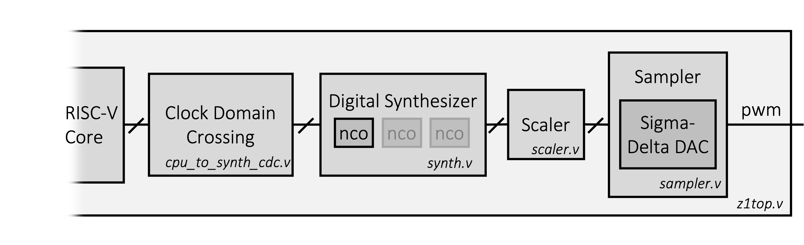
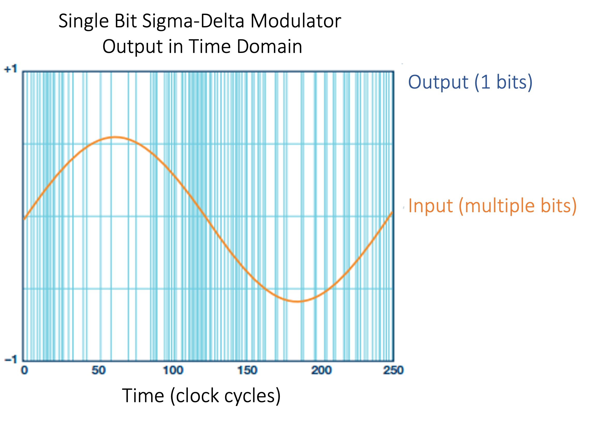
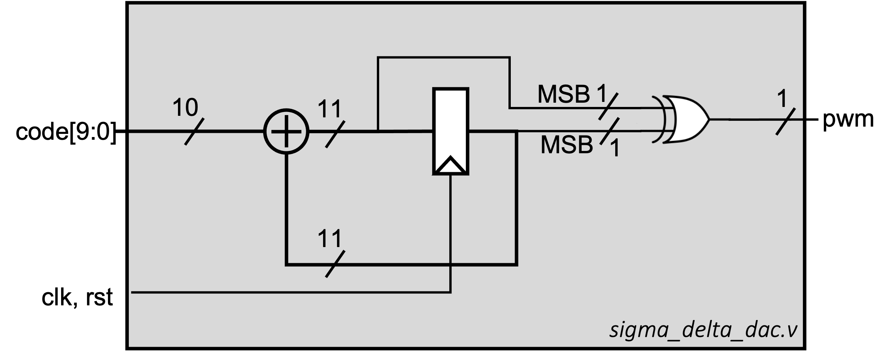
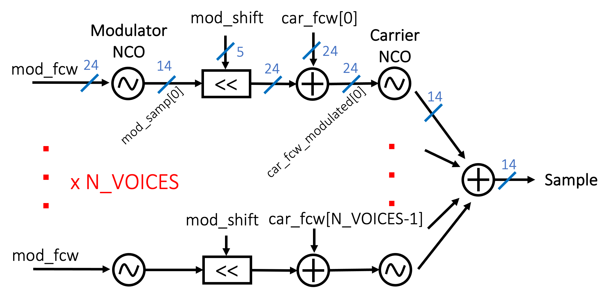
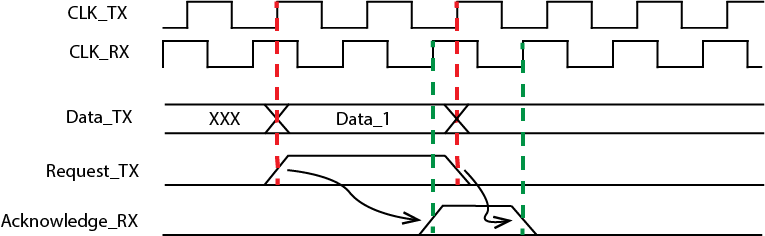
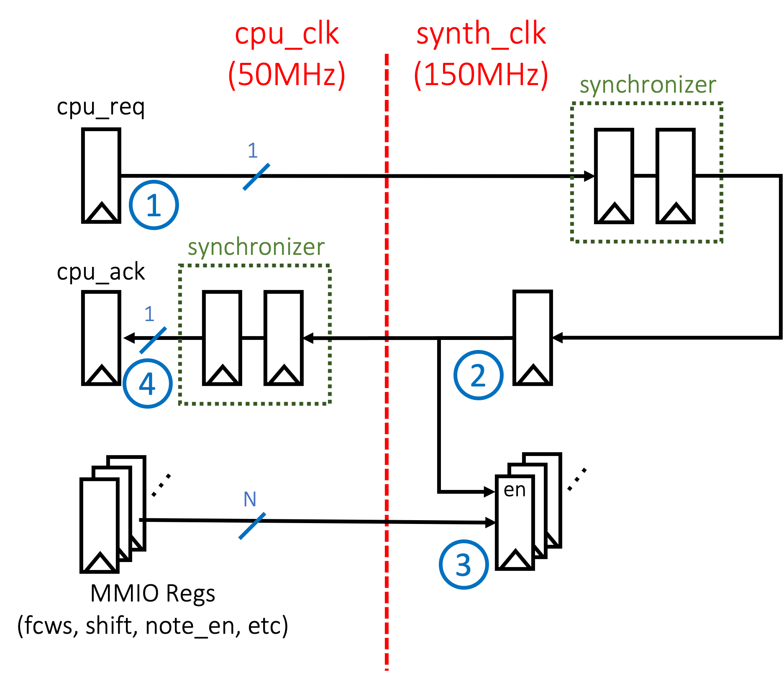

# Checkpoint 3: Digital Synthesizer,  Sigma-Delta DAC
In checkpoint 3 of this project, you will implement a new memory-mapped I/O interface to user inputs and outputs (buttons. LEDs, and switches).
To buffer user inputs to your processor, you will integrate the FIFO you built in the lab.

In lab 5, we built an UART.
With some simple logic blocks (in `z1top.v`), a character from the host was transformed from lower case to upper case and echoed back.
In project checkpoint 2, we achieved similar functionality using the the CPU to process the character, interfacing with the UART MMIO.
In checkpoint 3, we will add another block that augments our CPU, this time an accelerator for audio synthesis.

## Checkpoint 3 Overview
<p align=center>
  
</p>

- Digital Synthesizer
- A new sigma-delta DAC drives the audio output
- Extended memory mapped I/O interface

### Copy Sources From Previous Lab
Make sure you have copied over the following sources from labs 4 and 6
- `button_parser.v`, `debouncer.v`, `edge_detector.v`, `uart_transmitter.v`, `fifo.v` into `hardware/src/io_circuits`

## User I/O Integration
In lab, you built a synchronizer, debouncer and an edge detector that were used to take in various user inputs.
Now, we want our processor to have access to these inputs (and the switches) and also to be able to drive outputs such as the LEDs.
We will extend our memory map to give programs access to these I/Os.

When a user pushes a button on the Pynq-Z1 board, the button's signal travels through the synchroniser -> debouncer -> edge detector chain (see the `button_parser` instance in `z1top.v`).
The result is a single clock cycle wide pulse coming out of the edge detector that represents a single button press.

If we just extended our memory map to directly include the outputs from the edge detector, the processor would have to read from those locations on every clock cycle to be sure it didn't miss any button presses.
To fix this, we will buffer user inputs with a FIFO and let the processor consume them when it has time to do so.

### Hookup User I/O
We want to give the processor access to these I/Os:
- Switches
- LEDs (the ones on the Pynq-Z1 board)
- Buttons

The I/O extension to the memory map is as follows:

| Address      | Function            | Access | Data Encoding          |
|--------------|---------------------|--------|------------------------|
| 32'h80000020 | GPIO FIFO Empty     | Read   | {31'd0, empty}         |
| 32'h80000024 | GPIO FIFO Read Data | Read   | {29'd0, buttons[2:0]}  |
| 32'h80000028 | Switches            | Read   | {30'd0, SWITCHES[1:0]} |
| 32'h80000030 | GPIO LEDs           | Write  | {26'd0, LEDS[5:0]}     |

On any given clock cycle, when any of the button signals pulse high, the FIFO should be written to with the status of all the button signals.
The CPU should be able to read the empty signal of the FIFO, and it should be able to read out data from the FIFO with the FIFO's `rd_en` signal controlled by your memory logic.

Modify `z1top.v` and `cpu.v` by instantiating your FIFO, hooking it up with signals from the `button_parser`, and connecting your FIFO's read interface to the RISC-V core.
Route the `SWITCHES` input and `LEDS` output into your CPU as you please.

### User I/O Test Program
The `software/user_io_test` tests the FIFO and user I/O integration.

After programming the FPGA, run `make` in the `user_io_test` folder, and run:
`./scripts/hex_to_serial ../software/user_io_test/user_io_test.hex 30000000`

Then run `screen $SERIALTTY 115200` and `jal 10000000` from the BIOS to jump into the user I/O test program.

This program supports several commands to help you debug and verify functionality:
- `read_buttons` - CPU reads from the GPIO FIFO until it is empty, decodes the button press data, and prints it out.
- `read_switches` - CPU reads the slide switches' address and prints out the state of the switches.
- `led <data>` - Writes the `<data>` (32-bits in hex) that you specify to the GPIO LEDs address.
   - We only have 6 LEDs on the board so you can write values up to 0x3F.
- `exit` - Jump back into BIOS.

## Sigma-Delta DAC
In lab 4 we built a simple DAC which is able to produce a square wave and drive the audio jack. Now, we want to build a sigma-delta DAC.

### Sigma-Delta Modulation
Sigma-Delta (also known as Delta-Sigma) modulation is a method for converting high resolution, low frequency digital signals into low resolution, high frequency digital signal. The high frequency digital signal can be converter to analog output if followed by a low-pass filter (LPF).
<p align=center>
  
</p>

### Sigma-Delta DAC
Similar to the previous labs, the DAC will drive a 1-bit audio PWM output. The sigma-delta DAC takes in `code[9:0]`, then generates a 0-1 sequence where the the frequency of 1 is corresponds to `code[9:0]`.
You can design the output sequence at will, as long as the number of 1 counts correctly. In fact, the DAC you built in the labs can also be considered as a sigma-delta DAC. However, better output signal quality can be achieved if the output spikes are **evenly distributed**. For example, when out = 4/16, s2 will have better signal quality than s1 and s0 after the LPF:

`s0: 4/16 = 0 1 1 1 1 0 0 0 0 0 0 0 0 0 0 0`

`s1: 4/16 = 0 1 0 1 0 1 0 1 0 0 0 0 0 0 0 0`

`s2: 4/16 = 0 0 0 1 0 0 0 1 0 0 0 1 0 0 0 1`

An easy implementation of a first order sigma-delta modulator is shown below in the diagram. The accumulator has one more bit than the input code. Whenever the accumulator overflows, output an 1. Otherwise output a 0.

<p align=center>
  
</p>

### Sigma-Delta DAC Testbench
Run the testbench in `sim/sigma_delta_dac_tb.v` that runs through a few test cases for the DAC.

## NCO
There is an NCO skeleton in `hardware/src/audio/nco.v`.
It is very similar to the one from the labs, but notice that the `code` output is 14 bits rather than 10 bits.

#### Fixed Point Representation of LUT Values
The values in the sine LUT will be signed numbers representing one period of a sampled sine wave.
They will be stored in a fixed point representation (10 fractional bits, 4 integer bits inclusive of 1 sign bit).
This encoding is similar to a 14-bit 2s complement signed number.
This number representation will be used through the entire synthesizer.
Review [this 61C handout](http://www-inst.eecs.berkeley.edu/~cs61c/sp06/handout/fixedpt.html) for a quick overview of fixed point numbers.

In short: this means the values of each bit for a fixed point binary number (from MSB to LSB) is `-2^3 2^2 2^1 2^0 1/2^1 1/2^2 ... 1/2^10`

### Implementation
<!-- Note that it is OK to use several clock cycles to generate one sample value, so pipelining is useful for making sure your critical paths are short. This may be necessary to close timing for this portion of the design. -->
In the labs, you were reading a `.bin` file into a 2D register.
However, for the project, a `sine_lut.v` (ROM) is generated in `hardware/src/audio` using the `generate_sine_lut` script.
You should instantiate the `sine_lut` in your NCO and use your lab solution to write the NCO implementation.

```sh
./scripts/audio/generate_sine_lut > ./hardware/src/audio/sine_lut.v
```

### Testing
We've provided models of the NCO and synth in `./scripts/audio/`.

To dump 1000 reference NCO samples for the sample rate of 60KHz and  440 Hz:

```sh
./nco_reference --f-samp 60000 --pa-bits 24 --f-sig 440 --num-samples 1000 --num-entries 256 --num-int-bits 4 --num-frac-bits 10
```

You should generate golden samples using the `nco_reference` script for various signal frequencies and use the provided testbench `nco_tb.v` to verify that your NCO produces identical samples.

<!--
#### NCO Non-Idealities
There are three sources of inaccuracy when using an NCO:
- Limited frequency resolution when converting a continuous frequency  to the integer frequency control word. This can be handled by choosing a large phase accumulator bit width.
- Using a smaller LUT ( entries) than the phase accumulator width ( possible values) can accomodate. This can be alleviated using interpolation.
- Fixed point quantization vs. arbitrary precision representation of the LUT values. This can be handled by using more bits per LUT element at the cost of area.
-->

## FM Synthesizer
<p align=center>
  
</p>
In lab, we hooked up one NCO directly to the DAC, enabling us to play sine waves through the headphone jack.
In the project, we want to try a more interesting synthesis technique where we use one NCO to modulate the `fcw` of another.
This is frequency modulation synthesis.

The technique is simple: we use 2 NCOs, a carrier and a modulator.
To generate a sample for the full chain, we perform the following tasks:

1. Apply the modulator FCW (`mod_fcw`) to the modulator NCO
2. Fetch a new sample from the modulator NCO (`mod_samp`)
3. Modulate the FCW of the carrier NCO (`carrier_fcw`) by using a left shifted version of the `mod_samp`
    - `carrier_fcw_modulated = carrier_fcw + (mod_samp << mod_shift)`
    - Note that `mod_samp` is 14 bits while `carrier_fcw` is 24 bits (this is why we are using a left shifted version of `mod_samp` to achieve sufficient 'modulation' of the carrier FCW)
4. Apply `carrier_fcw_modulated` to the carrier NCO
5. Fetch a new sample from the carrier NCO (`sample`)
`sample` is a sample of the full synthesizer.

You may want to check out [this interactive website](https://observablehq.com/@ramonaisonline/synthesis) for a demonstration of this technique.

### Implementation
Implement FM synthesis in `hardware/src/audio/synth.v`.

The `synth` uses a ready-valid interface to output samples (`sample`, `sample_valid`, `sample_ready`).
Your `synth` should eagerly set `sample_valid` as soon as possible and should only move onto generating the next sample when `sample_ready` goes high.

Assume that `carrier_fcws`, `mod_fcw`, `mod_shift`, and `note_en` are inputs that come directly from registers.

The `note_en` signal specifies whether a carrier + modulator NCO pair is active.
If `note_en` is 0, you should continue to emit samples, but the `sample` value should be constant.
If `note_en` is 0, you should freeze the state of the indicated carrier + modulator NCO pair.

**251A Only**: Implement a polyphonic synth.
The `N_VOICES` parameter indicates how many carrier + modulator NCO pairs exist in the `synth`.
You should support `N_VOICES = 4`.
You should attempt to generate a sample for each carrier + modulator NCO pair in parallel, and sum all the samples to form the final `sample`.
Note that the `note_en` signal allows you to turn on/off each NCO pair (i.e. voice).

### Testing
We have provided a model of the synth in `hardware/scripts/audio`.
Here is how to dump 60k reference synth samples and play the audio they represent:
```sh
./synth_reference --f-samp 60000 --pa-bits 24 --num-samples 60000 --num-entries 256 --num-int-bits 4 --num-frac-bits 10 > audio.txt
./audio_from_sim --f-samp 60000 audio.txt audio.wav
play audio.wav
```

Inspect `synth_reference` to see what modulator / carrier FCW and shift parameters are being used.

Use `sim/synth_tb.v` to dump samples from your `synth` and the `audio_from_sim` script to generate an audio file to compare with the reference.
You can also use `./synth_reference` to dump golden DAC samples for use with `synth_tb.v`.

## From Synth to DAC

### Scaler
The synth produces 14-bit 2s complement signed samples, but the DAC takes 10-bit unsigned samples.
We have provided a simple combinational module in `src/audio/scaler.v` that performs the conversion from 14-bit signed to 10-bit signed by truncating the LSB synth sample bits and shifting signed `0` to unsigned `1024/2`.
When instantiating the `scaler` you can hardcode the `synth_shift` input to 0 (it is only for debug).

<!--
The scaler performs this conversion:
 - `sample = -2^9`: duty cycle[9:0] = 0
 - `0`: duty cycle[9:0] = 512
 - `2^9 - 1`: duty cycle[9:0] = 1023
-->

### Sampler
The sigma-delta DAC we designed has a sampling frequency equal to its clock frequency: **150 MHz**.
However, to produce an FCW corresponding to a particular frequency for our NCO, we need to produce samples from the NCO at a known rate.
We have decided to fetch those samples at a rate of **60 kHz** (150 MHz / 2500 = 60 kHz).

Your sampler in `src/audio/sampler.v` interacts with the ready-valid interface of the `synth`.
It receives the 10-bit unsigned code from passing the synth's code through the `scaler`.

Your job is to implement the `sampler` such that it fetches samples from the NCO at a rate of 60 kHz and feeds each sample to the DAC at the exact rate of 60 kHz.
You should instantiate the sigma-delta DAC in the `sampler` and connect its output to `pwm_out`.
Keep in mind that your `synth` requires several cycles to produce one sample, so you want to fetch a sample earlier than the DAC's sample edge so you can feed it to the DAC at precise intervals.

## CPU Interface

### RISC-V Core Connection
As you memory map the inputs of the synth block, there's a catch.
In order for your DAC to operate correctly, it will need to run very fast (much faster than your processor).
This implies that your DAC and synth will be running inside a different clock domain.

We dealt with clock domain crossings (CDCs) before (our synchronizer took an asynchronous signal and brought it into a synchronous domain).
However the single-bit synchronizer only works with 1-bit signals and not a 24-bit bus like the FCW input to the synth.
We will implement a 4 phase handshake to make sure we reliably pass data from the RISC-V core's clock domain (TX/Transmit domain) to the synth block's clock domain (RX/Receive domain).

A timing diagram is shown below:
<p align=center>
  
</p>

The four phase handshake uses four signals (`req_tx`, `req_rx`, `ack_rx`, and `ack_tx`).
`req_rx` is the `req_tx` signal synchronized into the RX domain, and `ack_tx` is the `ack_rx` signal synchronized into the TX domain.
Clock domain crossing requires the generation of two new synchronous signals, request and acknowledge, and the comparison of 4 edges.
- Request is asserted at the same time that the data is registered in the TX domain
- Acknowledge is asserted from the RX domain after the data has been captured in the RX domain (this could require holding the data for two clock cycles to ensure data coherency)
- Request is de-asserted in the TX domain
- Acknowledge is de-asserted in the RX domain and is then de-asserted in the TX domain

Implement this with 2-flop synchronizers that synchronize the request and acknowledge signals between the clock domains.
A block diagram is shown below:
<p align=center>
  
</p>

The numbers highlight the flow of data through the synchronizer circuit.
Here is a detailed sequence of steps to send data from the TX domain to the RX domain:
- First, the RISC-V core stores the duty cycle to the TX data register and then sets the TX request register high
- The TX request bit is synchronized into the RX domain
- Once the RX request bit is high, the RX data register takes in the value from the TX data register (knowing that the TX data register has been stable for 2 cycles)
- The RX request bit is synchronized back to the TX domain as an acknowledge bit
- This concludes a data transfer. To prepare for the next transfer, the TX request bit is de-asserted
- This will cause the TX acknowledge bit to be de-asserted
- The transmitting side is ready for a new data transfer

While this is slower than simply passing data through clock domains, it transmits data reliably.

### Implementation
Implement the 4-phase handshake circuit in `src/audio/cpu_to_synth_cdc.v` using `synchronizer` modules.

Then connect MMIO registers to your CPU according to the memory map below.
Your RISC-V core will handle all of the requests and acknowledges in software through a memory mapped interface detailed below.

| Address      | Function                 | Access | Data Encoding           |
|--------------|--------------------------|--------|-------------------------|
| 32'h80000100 | Carrier NCO 1 FCW        | Write  | {8'd0, car_fcw[23:0]}   |
| 32'h80000104 | Carrier NCO 2 FCW (251A) | Write  | {8'd0, car_fcw[23:0]}   |
| 32'h80000108 | Carrier NCO 3 FCW (251A) | Write  | {8'd0, car_fcw[23:0]}   |
| 32'h8000010C | Carrier NCO 4 FCW (251A) | Write  | {8'd0, car_fcw[23:0]}   |
| 32'h80000200 | Modulator NCO FCW        | Write  | {8'd0, mod_fcw[23:0]}   |
| 32'h80000204 | Modulator NCO shift term | Write  | {27'd0, mod_shift[4:0]} |
| 32'h80000208 | Note enable signal       | Write  | {31'd0, note_en[N_VOICES-1:0]}        |
| 32'h80000210 | CPU TX Request           | Write  | {31'b0, tx_req}         |
| 32'h80000214 | CPU TX Acknowledge       | Read   | {31'b0, tx_ack}         |

### Synth Integration
Connect your CPU MMIO registers to the signal chain that forms the synth:

`CPU MMIO registers -> cpu_to_synth_cdc -> synth -> scaler -> sampler`

Wire these components in `z1top.v` and verify that `make lint` runs cleanly.
Connect the sigma-delta DAC output to `pwm_out` and use the `pwm_clk` (150 Mhz) and `pwm_rst` for all components in the synth clock domain.

## Top-Level Testing
We've provided a top-level testbench that integrates both the `synth` inside `z1top` and the `piano` software.
See `sim/synth_top_tb.v`.

To run the test, you may have to change some hierarchical paths to match those in your design.
You may also want to look at `software/piano` to see how the off-chip UART is being used to send commands to the `piano` program running on the CPU.

## FPGA Testing
Program the FPGA, `hex_to_serial` `software/piano` and `jal` to the piano program.
Exit screen, and run `./hardware/scripts/piano`.

This will open a GUI that allows you to play notes by pressing keys on your keyboard (similar to the lab) and allow you to change the modulator FCW and shift.
Try holding down a key and sliding the modulator FCW to see how the note's timbre changes.

## Checkpoint 3 Deliverables
- Demonstrate the correct functionality of the `piano` program on the FPGA.
