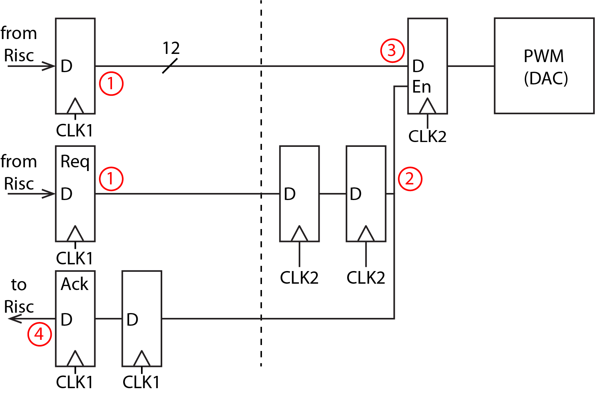

# Checkpoint 3: Digital Synthesizer,  Sigma-Delta DAC
In checkpoint 3 of this project, you will implement a new memory-mapped I/O interface to user inputs and outputs (buttons. LEDs, and switches). To buffer user inputs to your processor, you will integrate the FIFO you built in the lab.
In lab 5, we built an UART. With some simple logic blocks (in `z1top.v`), a character input from keyboard was transformed from lower case to upper case and echoed back. In project checkpoint 2, we can achieve similar functionality using the UART, while the character goes through the processor and the I/O we built. In checkpoint 3, we will add another block that augments our CPU, this time an accelerator for audio synthesis.

## Checkpoint 3 Overview
<p align=center>
  
</p>

- Digital Synthesizer
- A new sigma-delta DAC drives the audio output
- Extended memory mapped I/O interface


### Copy Sources From Previous Lab
```shell
cp your_path_to_lab4/src/button_parser.v your_path_to_project/hardware/src/io_circuits/
cp your_path_to_lab4/src/debouncer.v your_path_to_project/hardware/src/io_circuits/
cp your_path_to_lab4/src/edge_detector.v your_path_to_project/hardware/src/io_circuits/
cp your_path_to_lab4/src/uart_transmitter.v your_path_to_project/hardware/src/io_circuits/
cp your_path_to_lab6/src/fifo.v your_path_to_project/hardware/src/io_circuits/
cp your_path_to_lab4/src/nco.v your_path_to_project/hardware/src/audio
```

## I/O Integration

In lab, you built a synchronizer, debouncer and an edge detector that were used to take in various user inputs. Now, we want our processor to have access to these inputs (and the switches) and also to be able to drive outputs such as the LEDs. We will extend our memory map to give programs access to these I/Os.
When a user pushes a button on the Pynq-Z1 board, the button's signal travels through the synchroniser -> debouncer -> edge detector chain. The result is a single clock cycle wide pulse coming out of the edge detector that represents a single button press. If we just extended our memory map to directly include the outputs from the edge detector, the processor would have to read from those locations on every clock cycle to be sure it didn't miss any user inputs. 
To fix this, we will buffer user inputs with a FIFO and let the processor consume them when it has time to do so.

### Hookup User I/O
We want to give the processor access to these I/Os:
- Switches
- GPIO LEDs (the ones on the Pynq-Z1 board)
- Push-buttons

The I/O extension to the memory map is as below:

| Address      | Function            | Access | Data Encoding          |
|--------------|---------------------|--------|------------------------|
| 32'h80000020 | GPIO FIFO Empty     | Read   | {31'd0, empty}         |
| 32'h80000024 | GPIO FIFO Read Data | Read   | {29'd0, buttons[2:0]}  |
| 32'h80000028 | Switches            | Read   | {30'd0, SWITCHES[1:0]} |
| 32'h80000030 | GPIO LEDs           | Write  | {26'd0, LEDS[5:0]}     |

On any given clock cycle, when any of the button signals pulse high, the FIFO should be written to with the status of all the button signals. The CPU should be able to read the empty signal of the FIFO, and it should be able to read out data from the FIFO with the FIFO's `rd_en` signal controlled by your memory logic.

Modify `z1top.v` and `Riscv151.v` by instantiating your FIFO, hooking up its ports to the user I/O signals, and connecting your FIFO's read interface to the RISC-V core.

### User I/O Test Program
The `software/user_io_test` tests the FIFO and user I/O integration.
After programming the FPGA, run`make` in the `user_io_test` folder, and run:
 `hex_to_serial user_io_test.hex 30000000`
Then `screen` and `jal 10000000` from the BIOS to jump into the user I/O test program.

This program has several commands to help you debug and verify functionality:
- `read_buttons` - CPU reads from the GPIO FIFO until it is empty, decodes the button press data, and prints it out.
- `read_switches` - CPU reads the slide switches' address and prints out the state of the switches.
 - `led <data>` - Writes the `<data>` (32-bits in hex) that you specify to the GPIO LEDs address. We only have 6 LEDs on the board so you can write values up to 0x3F.
- `exit` - Jump back into BIOS.


## Sigma-Delta DAC
In lab 4 we built a simple DAC which is able to produce a square wave and drive the audio jack. Now, we want to build a sigma-delta DAC.

### Sigma-Delta Modulation
Sigma-Delta (also known as Delta-Sigma) modulation is a method for converting high resolution, low frequency digital signals into low resolution, high frequency digital signal. The high frequency digital signal can be converter to analog output if followed by a low-pass filter (LPF). 
<p align=center>
  
</p>

### Sigma-Delta DAC
Similar to the previous labs, the DAC will drive a 1-bit audio PWM output. The sigma-delta DAC takes in `code[9:0]`, then generates a 0-1 sequence where the the frequency of 1 is corresponds to `code[9:0]`.
You can design the output sequence at will, as long as the number of 1 counts correctly. In fact, the DAC you built in the labs can also be considered as a sigma-delta DAC. However, better output signal quality can be achieved if the output spikes are **evenly distributed**. For example, when out = 4/16, s2 will have better signal quality than s1 and s0 after the LPF:

`s0: 4/16 = 0 1 1 1 1 0 0 0 0 0 0 0 0 0 0 0`

`s1: 4/16 = 0 1 0 1 0 1 0 1 0 0 0 0 0 0 0 0`

`s2: 4/16 = 0 0 0 1 0 0 0 1 0 0 0 1 0 0 0 1`

An easy implementation of a first order sigma-delta modulator is shown below in the diagram. The accumulator has one more bit than the input code. Whenever the accumulator overflows, output an 1. Otherwise output a 0. 

<p align=center>
  
</p>

### Sigma-Delta DAC Testbench
We provide a test bench that can evaluate your DAC performance. Run as usual and make sure all test cases are passed.


## Audio Interface

### Digital Mixer

Mixing or multiplication is one of the most useful RF or signal frequency processes. It enables a signal to be changed from one frequency to another. You might change a signal to a lower frequency so that signal processing is easier to perform, or to a higher frequency when the signal is to be transmitted or received.

Say we have a sine wave LO at the frequency of  and a sine wave signal near it  . Mixing these two signal gives:

<p align=center>

</p>
<p align=center>

</p>

A combination of two new signals at  and  is created as a result. By passing through a low path filter (LPF) or high pass filter (HPF), we can keep only one of them.


### Subtractive Synth
While the piano program works, it can only play a single note at a time (monophonic synthesis).
More importantly, it's limited to the CPI of the processor and this in turn limits the waveforms we can send to our DAC.
How could we improve our synthesizer's throughput and implement a polyphonic synthesizer?
Hardware acceleration!
We can implement most of the subtractive synthesis blocks in hardware and lay the groundwork for building a rich sounding synthesizer.
The main datapath that we'll be implementing is shown below:
\begin{center}
  \includegraphics[width=0.9\textwidth]{images/ss_dp_1.png}
\end{center}
The synthesizer is composed of three blocks:
\begin{enumerate}
  \item Numerically controlled oscillator (NCO). Produces sampled sine, square, triangle, and sawtooth waveforms of programmable frequency. - \textbf{Required}
  \item State variable filter (SVF). A 2nd order digital IIR filter. - \textbf{Optional, Extra Credit}
  \item Amplitude envelope (ADSR - attack, decay, sustain, release) - \textbf{Optional, Extra Credit}
\end{enumerate}
The RISC-V core controls the parameters for each of the blocks using registers that are memory mapped.
A collection of parameter values designed to mimic a particular instrument is called a patch.
The RISC-V core also provides the frequency control word for the NCO, which represents the pitch of a note to play.
Once a note to play is sent to the synthesizer, it will select/sum the appropriate waveforms (from the NCO), filter the samples through the SVF, and apply an ADSR envelope.
The synthesizer should feed samples at the sample rate ($f_{samp}$) to the PWM DAC until the note is released.
This synthesizer is connected to the RISC-V core as shown below.
\begin{center}
  \includegraphics[width=\textwidth/2]{images/fourPhase_2.png}
\end{center}
This implements a monophonic synth which can play one note at a time, but we would like to play multiple notes at a time.
To accomplish this, we can replicate the monophonic synth and sum the output of the amplitude envelope blocks as shown in the figure below to produce a polyphonic synth.
\begin{center}
  \includegraphics[width=0.9\textwidth]{images/ss_dp_2.png}
\end{center}
\textbf{A polyphonic synth is required for 251A only}.
\subsubsection{Numerically Controlled Oscillator (NCO) - Required}
We want to generate four waveform types: sine, square, triangle, and sawtooth.
We'll discuss the sine wave generation and you can generalize it to the other waveform types.
\paragraph{NCO Overview}
A continuous time sine wave, with a frequency $f_{sig}$, can be written as:
\begin{equation*}
  f(t) = \sin \left( 2 \pi f_{sig} t \right)
\end{equation*}
If this sine wave is sampled with sampling frequency $f_{samp}$, the resulting stream of discrete time samples is:
\begin{equation*}
  f[n] = \sin \left( 2 \pi f_{sig} \frac{n}{f_{samp}} \right)
\end{equation*}
We want to generate this stream of samples in hardware.
One way to do this is to use a lookup table (LUT) and a phase accumulator (just a register and an adder).
Say we have a LUT that contains sampled points for one period of a sine wave with $2^N$ entries.
The entries $i, 0 \leq i < 2^N$ of this LUT are:
\begin{equation*}
  LUT[i] = \sin \left( i \frac{2 \pi}{2^N} \right)
\end{equation*}
To find the mapping of the sample $n$ to the LUT entry $i$, we can equate the expressions inside $\sin()$:
\begin{align*}
  i \frac{2 \pi}{2^N} &= 2 \pi f_{sig} \frac{n}{f_{samp}} \\
  i &= \underbrace{\left( \frac{f_{sig}}{f_{samp}} 2^N \right)}_{\text{phase increment}} n
\end{align*}
This means that to compute sample $n+1$ we should take the LUT index used for sample $n$ and increment the index by the `phase increment'.
The phase increment (also called the `frequency control word') is written by the RISC-V core into a MMIO register (24-bits wide).
To find the frequency resolution (the minimum frequency step) we can look at what change in $f_{sig}$ causes the phase increment to increase by 1:
\begin{align*}
  \frac{f_{sig} + \Delta_{f,min}}{f_{samp}} 2^N &= \frac{f_{sig}}{f_{samp}} 2^N + 1 \\
  \Delta_{f,min} &= \frac{f_{samp}}{2^N}
\end{align*}
This means for a example sample frequency $f_{samp}$ of 30 kHz and $N = 24$, the frequency resolution is 0.001 Hz.
We can have very precise frequency control using an NCO.
However, a $2^{24}$ entry LUT is huge and wouldn't fit on the FPGA.
So, we will keep the phase accumulator $N$ (24-bits) wide, and only use the MSB $M$ bits to index the sine wave LUT.
This means the LUT only contains $2^M$ entries, where $M$ is chosen based on the required phase error.
We will use $M = 8$.
\begin{figure}
  \centering
  \includegraphics[width=0.5\textwidth]{images/Generic_NCO.png}
  \caption{NCO architecture from \href{https://en.wikipedia.org/wiki/Numerically-controlled_oscillator}{Wikipedia}}
\end{figure}

#### Fixed Point Representation of LUT Values
The values in the sine LUT will be signed numbers representing one period of a sampled sine wave.
They will be stored in a fixed point representation (10 fractional bits, 4 integer bits inclusive of 1 sign bit).
This number representation will be used through the entire synthesizer.
Review [this 61C handout](http://www-inst.eecs.berkeley.edu/~cs61c/sp06/handout/fixedpt.html) for a quick overview of fixed point numbers.

#### NCO Non-Idealities
There are three sources of inaccuracy when using an NCO:
- Limited frequency resolution when converting a continuous frequency  to the integer frequency control word. This can be handled by choosing a large phase accumulator bit width.
- Using a smaller LUT ( entries) than the phase accumulator width ( possible values) can accomodate. This can be alleviated using interpolation.
- Fixed point quantization vs. arbitrary precision representation of the LUT values. This can be handled by using more bits per LUT element at the cost of area.


#### Implementation
Note that it is OK to use several clock cycles to generate one sample value, so pipelining is useful for making sure your critical paths are short. This may be necessary to close timing for this portion of the design.

In lab 4, you were reading a bin file into a register. However, for this project, a sine_lut.v is generated in hardware/src/audio using the `nco_reference` script. This is then used as a Verilog ROM in the NCO implementation to access codes.

#### Testing
We've provided models of the NCO and synth in `scripts/audio/`.

To dump 1000 reference NCO samples for sample rate 60KHz and  440 Hz:
```sh
./nco_reference --f-samp 60000 --pa-bits 24 --f-sig 440 --num-samples 1000 --num-entries 256 --num-int-bits 4 --num-frac-bits 10
```
You should generate golden samples from the `nco_reference` script for various signal frequencies and use the provided testbench `nco_tb.v` to verify that your NCO produces identical samples.

To dump 60,000 reference synth samples for the same parameters, then play that audio:
```sh
./synth_reference --f-samp 60000 --pa-bits 24 --num-samples 60000 --num-entries 256 --num-int-bits 4 --num-frac-bits 10 > audio.txt
./audio_from_sim --f-samp 60000 audio.txt audio.wav
mpv audio.wav
```
You should use `synth_reference` to dump golden DAC samples for use with `synth_tb.v`.


### Truncator
The synthesizer outputs fixed point samples (with 16 fractional bits and 4 integer bits).
But, the PWM DAC takes 10-bit unsigned duty cycle values.
The truncator should take the 10 MSB bits from the synth and treat them as a signed number.
Then that number should be converted into the PWM duty cycle value:
 - `-2^9`: duty cycle[9:0] = 0
 - `0`: duty cycle[9:0] = 512
 - `2^9 - 1`: duty cycle[9:0] = 1023


### Sampler
The synth continuously produces samples, but now we want to send those samples to the sigma-delta DAC at a fixed rate  of 60 KHz.
Implement a block that rate limits samples from the NCO and sends them to the sigma-delta DAC using a ready-valid handshake.


### Audio Integration
The audio top-level should stitch together the blocks above into a signal chain.
The top-level also contains control signals that the CPU can use to reset the synth.
The CPU will play notes by performing the following sequence:
\begin{enumerate}
  \item Configure the static parameters of the synth (sine/square/triangle/sawtooth NCO gain, global gain, PWM DAC source)
  \item Write to the global synth reset
  \item To play a particular note:
    \begin{enumerate}
      \item Write the note's FCW to \verb|0x8000_1000|
      \item Write to \verb|0x8000_1004| which should begin sending samples to the PWM DAC
      \item Once the note is released, the CPU writes to \verb|0x8000_1008|, and you should stop sending samples to the PWM DAC
      \item The CPU then polls for \verb|0x8000_100c| to go high, indicating the synth has flushed out all the samples to send
      \item The CPU writes to \verb|0x8000_1010| to clear \verb|note_finished| and any other synth state
    \end{enumerate}
\end{enumerate}


#### RISC-V Core Connection
As you memory map the input of the audio block, there's a catch.
In order for your DAC to operate correctly, it will need to run very fast (much faster than your processor).
This implies that your DAC will be running inside a different clock domain.

We dealt with clock domain crossings (CDCs) before (our synchronizer took an asynchronous signal and brought it into a synchronous domain).
However the single-bit synchronizer only works with 1-bit signals and not a 24-bit bus like the FCW input to the PWM controller.
We will implement a 4 phase handshake to make sure we reliably pass data from the RISC-V core's clock domain (TX/Transmit domain) to the PWM block's clock domain (RX/Receive domain).

A timing diagram is shown below:
<p align=center>
  
</p>

The four phase handshake uses four signals (`req_tx`, `req_rx`, `ack_rx`, and `ack_tx`).
`req_rx` is the `req_tx` signal synchronized into the RX domain, and `ack_tx` is the `ack_rx` signal synchronized into the TX domain.
Clock domain crossing requires the generation of two new synchronous signals, request and acknowledge, and the comparison of 4 edges.
- Request is asserted at the same time that the data is registered in the TX domain
- Acknowledge is asserted from the RX domain after the data has been captured in the RX domain (this could require holding the data for two clock cycles to ensure data coherency)
- Request is de-asserted in the TX domain
- Acknowledge is de-asserted in the RX domain and is then de-asserted in the TX domain

Implement this with 2-flop synchronizers that synchronize the request and acknowledge signals between the clock domains.
A block diagram is shown below:
<p align=center>
  
</p>

The numbers highlight the flow of data through the synchronizer circuit.
Here is a detailed sequence of steps to send data from the TX domain to the RX domain:
- First, the RISC-V core stores the duty cycle to the TX data register and then sets the TX request register high
- The TX request bit is synchronized into the RX domain
- Once the RX request bit is high, the RX data register takes in the value from the TX data register (knowing that the TX data register has been stable for 2 cycles)
- The RX request bit is synchronized back to the TX domain as an acknowledge bit
- This concludes a data transfer. To prepare for the next transfer, the TX request bit is de-asserted
- This will cause the TX acknowledge bit to be de-asserted
- The transmitting side is ready for a new data transfer

While this is slower than simply passing data through clock domains, it transmits data reliably.


#### Implementation

Your RISC-V core will handle all of the requests and acknowledges in software through a memory mapped interface detailed below.

| Address      | Function                 | Access | Data Encoding           |
|--------------|--------------------------|--------|-------------------------|
| 32'h80000100 | Carrier NCO FCW          | Write  | {8'd0, car_fcw[23:0]}   |
| 32'h80000200 | Modulator NCO FCW        | Write  | {8'd0, mod_fcw[23:0]}   |
| 32'h80000204 | Modulator NCO shift term | Write  | {27'd0, mod_shift[4:0]} |
| 32'h80000208 | Note enable signal       | Write  | {31'd0, note_en}        |
| 32'h80000210 | TX Request               | Write  | {31'b0, tx_req}         |
| 32'h80000214 | TX Acknowledge           | Read   | {31'b0, tx_ack}         |

Some code has been provided in `z1top.v` that declares a wire `pwm_out` which should connect to the output of your DAC.

A PLL has been instantiated in `z1top.v` which produces a 150 Mhz clock `pwm_clk_g` used for the audio blocks.
There's also a `pwm_rst` signal that can be used to reset these blocks.

You should first test each audio component using a block-level testbench.
Next try creating a testbench similar to the `echo_integration_testbench` that uses the piano software from the next section.
You will have to load the program into the IMEM and DMEM in simulation and set the `RESET_PC` accordingly (similar to `isa_tb.v`).


### Polyphonic Synthesis - 251A Only
To enable polyphony, instantiate multiple synths.
We'll use 4 voice polyphony.
Parameters that have MMIO addresses like \verb|0x8000_01xx| or \verb|0x8000_02xx| are shared among all synths.
Only the note-specific MMIO registers are distinct for each synth (Table \ref{poly_mmio}).
The 3rd nibble of the address distinguishes each synth's frequency control word registers.
A polyphonic synth model is in \verb|scripts/synth/Synth.py|.

The additions and changes to the MMIO are as follows:

| Address      | Function                              | Access | Data Encoding           |
|--------------|---------------------------------------|--------|-------------------------|
| 32'h80002100 | Carrier NCO FCW (Voice 2)             | Write  | {8'd0, car_fcw[23:0]}   |
| 32'h80003100 | Carrier NCO FCW (Voice 3)             | Write  | {8'd0, car_fcw[23:0]}   |
| 32'h80004100 | Carrier NCO FCW (Voice 4)             | Write  | {8'd0, car_fcw[23:0]}   |
| 32'h80000208 | Note enable signals                   | Write  | {28'd0, note_en[3:0]}   |


#### Polyphonic Summation and Gain
Sum each synth's signed 14-bit output. This will result in a louder audio output, so you should divide the summed value by the number of synths to normalize volume.


## Checkpoint 3 Deliverables

To checkoff for this lab, have these things ready to show the TA:

- When LO is bypassed, play a 440Hz (A4) sine wave directly. 
- When LO is enabled, play a C major chord (262Hz (C4) + 330Hz (E4) + 392Hz (G4)) by setting:  (or we can make this part as extra credit)
  -  
  -  
  -  
  - 
  - Check [this website](https://en.wikipedia.org/wiki/Major_chord) for reference. 
